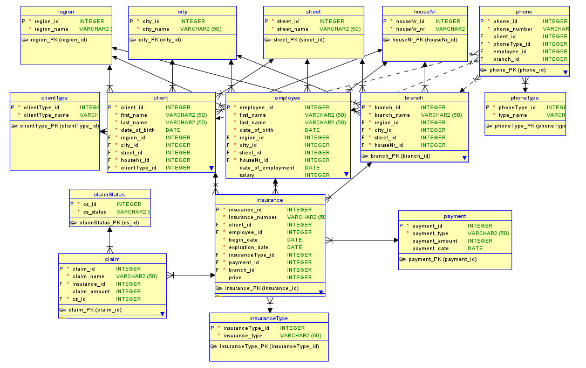
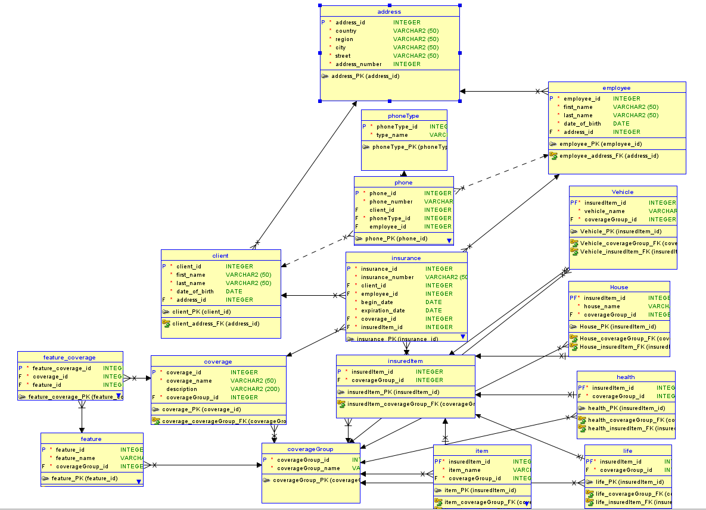
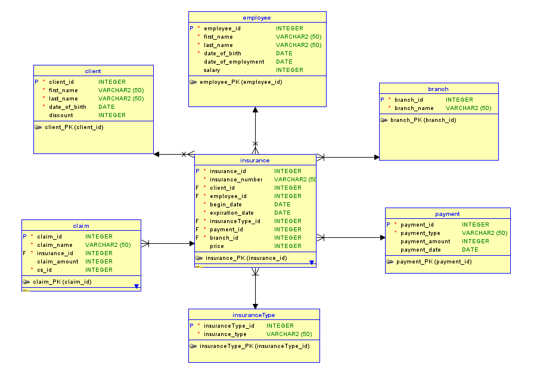

<!-- Improved compatibility of back to top link: See: https://github.com/othneildrew/Best-README-Template/pull/73 -->
<a name="readme-top"></a>
<!--
*** Thanks for checking out the Best-README-Template. If you have a suggestion
*** that would make this better, please fork the repo and create a pull request
*** or simply open an issue with the tag "enhancement".
*** Don't forget to give the project a star!
*** Thanks again! Now go create something AMAZING! :D
-->


<!-- PROJECT SHIELDS -->
<!--
*** I'm using markdown "reference style" links for readability.
*** Reference links are enclosed in brackets [ ] instead of parentheses ( ).
*** See the bottom of this document for the declaration of the reference variables
*** for contributors-url, forks-url, etc. This is an optional, concise syntax you may use.
*** https://www.markdownguide.org/basic-syntax/#reference-style-links
-->
[![Issues][issues-shield]][issues-url]
[![MIT License][license-shield]][license-url]

<!-- PROJECT LOGO -->
<br />
<div align="center">
  <a href="https://github.com/kielx/Insurance-company-database">
    
  </a>

<h3 align="center">Insurance company database and data warehouse</h3>

  <p align="center">
    The goal of the project was to create a fragment of an insurance company's database and a data warehouse based on it. The database contains information about the insurance company's customers, employees and branches, as well as the insurance policies between these entities. The database and warehouse designed this way allows for easy visualization and development of summaries of the work of all branches, employees, as well as policies taken by clients. The assumption is that a company can offer different types of policies - e.g., home insurance, vehicle insurance - and each customer can take out an unlimited number of policies. The project was developed entirely in the environment offered by Oracle, using SQL Developer and SQL Developer Data Modeler, as well as the SQL*Loader tool. The scripts generating the data with which the database was fed were written in Python using the Faker library. 
    <br />
    <br />
    <a href="https://github.com/kielx/Insurance-company-database/issues">Report Bug</a>
  </p>
</div>


<!-- TABLE OF CONTENTS -->
<details>
  <summary>Table of Contents</summary>
  <ol>
    <li>
      <a href="#about-the-project">About The Project</a>
      <ul>
        <li><a href="#built-with">Built With</a></li>
      </ul>
    </li>
    <li>
      <a href="#getting-started">Getting Started</a>
      <ul>
        <li><a href="#prerequisites">Prerequisites</a></li>
        <li><a href="#installation">Installation</a></li>
      </ul>
    </li>
    <li><a href="#usage">Usage</a></li>
    <li><a href="#roadmap">Roadmap</a></li>
    <li><a href="#contributing">Contributing</a></li>
    <li><a href="#license">License</a></li>
    <li><a href="#contact">Contact</a></li>
    <li><a href="#acknowledgments">Acknowledgments</a></li>
  </ol>
</details>


<!-- ABOUT THE PROJECT -->
## About The Project



This project was part of my coursework done through my studies at the Kielce University of Technology. It aimed to create a simplified version of a database for an insurance company (under 20 tables) and later to build a data warehouse on top of it (using a star schema). 

Prior to starting work on this project, I did research to determine if anyone had created something similar and made it available to the public. Unfortunately, the results of my search were less than satisfactory. I had to attempt to create the database model, the relationships, the data generator, the transformation of the data into a data warehouse and all the queries myself. However, this was my first approach to creating a database and data warehouse so the model or queries may contain errors or fall short of good practices. Nevertheless, below you will find the results of my work, which may be useful to those who are tasked with creating a similar project. 

If you would like to know more about the creation process you can jump to [Roadmap](#Roadmap). If you want to see the project in action you will have to follow the steps described in [Getting Started](#Getting-Started)

<p align="right">(<a href="#readme-top">back to top</a>)</p>


### Built With

* [![SQLDeveloper][SQLDeveloper]][SQLDeveloper-url]
* [![SQLDataModeler][SQLDataModeler]][SQLDataModeler-url]
* [![SQLLoader][SQLLoader]][SQLLoader-url]
* [![Python][Python]][Python-url]


<p align="right">(<a href="#readme-top">back to top</a>)</p>


<!-- GETTING STARTED -->
## Getting Started

To start working with this project you need to install Oracle Express database.
You can find instructions on how to perform this process here:
[Oracle Database XE Quick Start](https://www.oracle.com/pl/database/technologies/appdev/xe/quickstart.html)

The more experienced users can use the Docker image: 
[Oracle Container Registry](https://container-registry.oracle.com/) 
Look for the appropriate image under Database -> Express

The database model is created in [Oracle SQL Data Modeler](https://www.oracle.com/pl/database/sqldeveloper/technologies/sql-data-modeler/). This tool is useful to more easily visualize and create the structure of the database.

To operate the database I used [SQL Developer](https://www.oracle.com/database/sqldeveloper/)

When we have all the tools we can proceed to launch the project. You can use the project structure below and roadmap to navigate the project. Refer to [Usage section](#Usage) for quick tips on how to operate on project. 

## Basic Usage 

1. Be sure that you have installed all the prerequisites from [Getting Started section](#Getting-started)
2. Open SQL Developer and run ```01_database/create.sql``` to create the database
- Open ```01_database/dataGenerator/main.py``` and change set USERNAME, set PASSWORD, set CONNECTION_STRING values to fit your database connection.
- Run `01_database/dataGenerator/main.py`


- OR You could also invoke load_data.bat, and provide username, password and connection string via the command line:
```bash
.\load_files.bat yourUserName yourPassword yourDatabaseConnectionString
```
3. Query the database using the ```03_queries/``` of your choice
4. You can create a separate database instance and use ```02_data_warehouse/create.sql``` and ```02_data_warehouse/insertsql``` to create tables with data exported from the database. If you want to export your own set of data you can follow the instructions provided [on the Oracle website](https://docs.oracle.com/cd/E17781_01/server.112/e18804/impexp.htm#BABJIFDA)
5. Query the created data warehouse with queries from ```03_queries/```


## Project structure


```bash
├── 01_database // Database related files
│   ├── create.sql // Sql script that creates database tables - DDL generated from model
│   ├── dataGenerator // Files related to data generator script AND generated by script
│   │   ├── generatedData // Folder containing .csv files with generated data from python script
│   │   │   ├── branch.csv
│   │   │   ├── city.csv
│   │   │   ├── claim.csv
│   │   │   ├── claimStatus.csv
│   │   │   ├── client.csv
│   │   │   ├── clientType.csv
│   │   │   ├── employee.csv
│   │   │   ├── houseNr.csv
│   │   │   ├── insurance.csv
│   │   │   ├── insuranceType.csv
│   │   │   ├── payment.csv
│   │   │   ├── phone.csv
│   │   │   ├── phoneType.csv
│   │   │   ├── region.csv
│   │   │   └── street.csv
│   │   └── main.py // Generates data to populate database. Also contains functions that create files and scripts to load data
│   ├── load_files.bat // Batch file that invokes sqlldr 
│   ├── model_database // Folder containing model files
│   │   └── model.dmd
│   └── sqlldr // Everything related to sqlloader. All files inside get generated by main.py script
│       ├── bads // If loading goes wrong, info will be available here
│       ├── branch.ctl
│       ├── city.ctl
│       ├── claim.ctl
│       ├── claimStatus.ctl
│       ├── client.ctl
│       ├── clientType.ctl
│       ├── employee.ctl
│       ├── houseNr.ctl
│       ├── insurance.ctl
│       ├── insuranceType.ctl
│       ├── payment.ctl
│       ├── phone.ctl
│       ├── phoneType.ctl
│       ├── region.ctl
│       └── street.ctl
│       ├── logs // Sqlloader log files
│       │   ├── branch.log
│       │   ├── city.log
│       │   ├── claim.log
│       │   ├── claimStatus.log
│       │   ├── client.log
│       │   ├── clientType.log
│       │   ├── employee.log
│       │   ├── houseNr.log
│       │   ├── insurance.log
│       │   ├── insuranceType.log
│       │   ├── payment.log
│       │   ├── phone.log
│       │   ├── phoneType.log
│       │   ├── region.log
│       │   └── street.log
├── 02_data_warehouse // Files related to data warehouse. Create and insert scripts along with model.
│   ├── create.sql
│   ├── insert.sql
│   └── model_data_warehouse
│       └── model.dmd
├── 03_queries // All database and data warehouse queries divided by type
│   ├── 01_rollup
│   │   ├── database.sql
│   │   └── warehouse.sql
│   ├── 02_cube
│   │   ├── database.sql
│   │   └── warehouse.sql
│   ├── 03_partition
│   │   ├── database.sql
│   │   └── warehouse.sql
│   ├── 04_window
│   │   ├── database.sql
│   │   └── warehouse.sql
│   └── 05_rank
│       ├── database.sql
│       └── warehouse.sql
├── images // README images
│   ├── data_warehouse.png
│   ├── example_query.png
│   ├── logo.png
│   ├── original_design.png
│   └── screenshot.png
├── LICENSE.txt
└── README.md
```

<p align="right">(<a href="#readme-top">back to top</a>)</p>


<!-- ROADMAP -->
## Roadmap

### Original Idea and database model

My original idea was to create a more real-life database design following all normalization principles. It looked something like that:



You can check it out [here](https://github.com/Kielx/Insurance-company-database/tree/original-design/model). 

I later had to transform it into the design that you can see in the first screenshot in the about section. The reason for it was that it could become too complicated to create a data warehouse and queries based on my original design. Here is the finished data warehouse model:



To create the models I used [Oracle SQL Data Modeler](https://www.oracle.com/database/sqldeveloper/technologies/sql-data-modeler/download/). It's a great tool that can be used to create logical models, convert them to physical models, and finally DDL. 

### Data generation and loading data with SQL*Loader

With database and data warehouse models created I had to generate the necessary data (one of the project requirements was that tables should be loaded with at least 1000 or 10000 rows of data). I could take the short path and use one of the data generation tools available on the web but I decided that the web available tools wouldn't make a cut and decided to create a python script using the Faker library to generate the data. It proved to be a sound decision because I used the same script to generate control files for SQL* Loader and write lines to batch files that could then be run to load data into the database. SQL * Loader is a tool developed by Oracle, that can be invoked through command line to load files (.csv files in our case) into database. The syntax to load data looks like this:

```shell
sqlldr %USERNAME%/%PASSWORD%%CONNECTION_STRING% control='sqlldr/region.ctl' log='sqlldr/logs/region.log' bad='sqlldr/bads/region.bad'
```

Invoking such command for each of 15 tables would be tedious and ineffective.

My idea to simplify the process was to:
1. Generate the data for the tables using separate python functions (the last line invokes a function to generate control file)
```python
def generate_branches(records):
    headers = ["branch_id", "branch_name", "region_id", "city_id", "street_id", "houseNr_id"]

    with open(f"./generatedData/branch.csv", 'wt', newline='') as csvFile:
        writer = csv.DictWriter(csvFile, fieldnames=headers)
        writer.writeheader()
        for i in range(records):
            writer.writerow({
                headers[0]: i,
                headers[1]: faker.company(),
                headers[2]: i % 16,
                headers[3]: i % 16,
                headers[4]: i % 16,
                headers[5]: i,
            })
    print(f'Successfully generated {records} branches')
    create_ctl_file("branch", headers)
```

2. Invoke a function that will create a .ctl file that will control the data loading to the database through SQL*Loader

```python
def create_ctl_file(filename, headers):
    file = open(f'../sqlldr/{filename}.ctl', "w+")
    file.write("LOAD DATA\n")
    file.write(f"INFILE 'dataGenerator/generatedData/{filename}.csv'\n")
    file.write("REPLACE\n")
    file.write(f"INTO TABLE {filename}\n")
    file.write("FIELDS TERMINATED BY ',' OPTIONALLY ENCLOSED BY '\"'\n")
    file.write("TRAILING NULLCOLS\n")
    file.write("(\n")
    for i in range(len(headers)):
        if re.search(r'date', headers[i], re.IGNORECASE):
            file.write(f'{headers[i]} DATE "yyyy-mm-dd"')
        else:
            file.write(headers[i])
        if i != (len(headers) - 1):
            file.write(",")
    file.write("\n)")
    file.close()
    print(f"Successfully generated {filename}.ctl file")
    bat_file = open('../load_data.bat', "a+")
    bat_file.write(f"sqlldr %USERNAME%/%PASSWORD%%CONNECTION_STRING% control='sqlldr/{filename}.ctl' log='sqlldr/logs/{filename}.log' bad='sqlldr/bads/{filename}.bad'\n")
    bat_file.close()
    print(f"Successfully appended {filename} data to load_files.bat")

```

3. Append the appropriate line to the batch file and save it. It can be conveniently run to load data using SQL*Loader. ```load_files.bat```
```python
@echo off

rem Script that loads previously created data into the database using sqlldr
rem To change the default values you need to call the script and enter them sequentially as command arguments
rem Run the script using a command line, e.g. cmd
rem Then we move to the folder where the script is located
rem And then run it by entering the command .\data.bat
rem This command will run it with the default user data
rem If you want to change it, enter other data, e.g. .\load_data.bat username password my_base:1521


rem Set default values for the connection
set USERNAME=kielx
set PASSWORD=d11
set CONNECTION_STRING=@//localhost:1521/XEPDB1

rem Check if values exist
if not "%1"=="" (
  set USERNAME=%1
) 

if not "%2"=="" (
  set PASSWORD=%2
) 

if not "%3"=="" (
  set CONNECTION_STRING=%3
) 

sqlldr %USERNAME%/%PASSWORD%%CONNECTION_STRING% control='sqlldr/region.ctl' log='sqlldr/logs/region.log' bad='sqlldr/bads/region.bad'
sqlldr %USERNAME%/%PASSWORD%%CONNECTION_STRING% control='sqlldr/city.ctl' log='sqlldr/logs/city.log' bad='sqlldr/bads/city.bad'
sqlldr %USERNAME%/%PASSWORD%%CONNECTION_STRING% control='sqlldr/street.ctl' log='sqlldr/logs/street.log' bad='sqlldr/bads/street.bad'
sqlldr %USERNAME%/%PASSWORD%%CONNECTION_STRING% control='sqlldr/houseNr.ctl' log='sqlldr/logs/houseNr.log' bad='sqlldr/bads/houseNr.bad'
sqlldr %USERNAME%/%PASSWORD%%CONNECTION_STRING% control='sqlldr/clientType.ctl' log='sqlldr/logs/clientType.log' bad='sqlldr/bads/clientType.bad'
sqlldr %USERNAME%/%PASSWORD%%CONNECTION_STRING% control='sqlldr/client.ctl' log='sqlldr/logs/client.log' bad='sqlldr/bads/client.bad'
sqlldr %USERNAME%/%PASSWORD%%CONNECTION_STRING% control='sqlldr/employee.ctl' log='sqlldr/logs/employee.log' bad='sqlldr/bads/employee.bad'
sqlldr %USERNAME%/%PASSWORD%%CONNECTION_STRING% control='sqlldr/branch.ctl' log='sqlldr/logs/branch.log' bad='sqlldr/bads/branch.bad'
sqlldr %USERNAME%/%PASSWORD%%CONNECTION_STRING% control='sqlldr/phoneType.ctl' log='sqlldr/logs/phoneType.log' bad='sqlldr/bads/phoneType.bad'
sqlldr %USERNAME%/%PASSWORD%%CONNECTION_STRING% control='sqlldr/phone.ctl' log='sqlldr/logs/phone.log' bad='sqlldr/bads/phone.bad'
sqlldr %USERNAME%/%PASSWORD%%CONNECTION_STRING% control='sqlldr/payment.ctl' log='sqlldr/logs/payment.log' bad='sqlldr/bads/payment.bad'
sqlldr %USERNAME%/%PASSWORD%%CONNECTION_STRING% control='sqlldr/insuranceType.ctl' log='sqlldr/logs/insuranceType.log' bad='sqlldr/bads/insuranceType.bad'
sqlldr %USERNAME%/%PASSWORD%%CONNECTION_STRING% control='sqlldr/insurance.ctl' log='sqlldr/logs/insurance.log' bad='sqlldr/bads/insurance.bad'
sqlldr %USERNAME%/%PASSWORD%%CONNECTION_STRING% control='sqlldr/claimStatus.ctl' log='sqlldr/logs/claimStatus.log' bad='sqlldr/bads/claimStatus.bad'
sqlldr %USERNAME%/%PASSWORD%%CONNECTION_STRING% control='sqlldr/claim.ctl' log='sqlldr/logs/claim.log' bad='sqlldr/bads/claim.bad'

```

All this code is held in ```01_database/dataGenerator```, with generated data being in ```01_database/dataGenerator/generatedData``` subfolder and control files that handle loading are held in ```01_database/sqlldr```. The .bat file that can be used to load the data, is generated by the python program and can be run with command arguments that specify a username, password, and database connection string. 

### Database to data warehouse conversion

To convert the database tables and data into a data warehouse I used Oracle SQL Developer Export Wizard. It proved to be an easy way to achieve my goal. I tried to use the Oracle data pump but couldn't get it to work.  All related files are held in ```02_data_warehouse``` folder

### Queries

Queries to the database are stored in ```03_queries``` folder. Each type of query is stored in separate folder (one for each - rollup, cube, partition, windows and rank functions).
Queries differ depending on whether they are executed against a database or a data warehouse. One of project requierements was to store them in that way, with queries to database in file named ```database.sql``` and queries to data warehouse in ```warehouse.sql```

Example ROLLUP query with annual summary of the number of insurance policies sold in relation to the branch and type of policy: 

```oraclesqlplus
SELECT EXTRACT(YEAR FROM insurance.begin_date) AS Year,
  NVL2(branch.branch_name, branch.branch_name, 'All Branches') AS Branch_Name,
  NVL2(insurancetype.insurance_type, insurancetype.insurance_type, 'All Policies') AS Policy_Type,
  COUNT(insurance.insuranceType_id) AS Number_of_Policies
FROM insurance
INNER JOIN insuranceType
ON insurance.insurancetype_id = insurancetype.insurancetype_id
INNER JOIN branch
ON insurance.branch_id = branch.branch_id
GROUP BY ROLLUP (EXTRACT(YEAR FROM insurance.begin_date), branch.branch_name, insurancetype.insurance_type )
ORDER BY EXTRACT(YEAR FROM insurance.begin_date),
  branch.branch_name,
  COUNT(insurance.insuranceType_id) DESC;
```

This query returns a summary of the number of insurance policies sold each year, grouped by branch name and policy type. The ROLLUP operator is used to generate subtotals for each year, branch name, and policy type. The NVL2 function is used to replace NULL values in the branch name and policy type columns with 'All Branches' and 'All Policies', respectively. The result is ordered by year, branch name, and number of policies sold in descending order.


<p align="right">(<a href="#readme-top">back to top</a>)</p>

<!-- LICENSE -->
## License

Distributed under the MIT License. See `LICENSE.txt` for more information.

<p align="right">(<a href="#readme-top">back to top</a>)</p>


<!-- CONTACT -->
## Contact

Krzysztof Pantak - kielx.dev@gmail.com

[Website](https://pantak.net)

<p align="right">(<a href="#readme-top">back to top</a>)</p>


<!-- MARKDOWN LINKS & IMAGES -->
<!-- https://www.markdownguide.org/basic-syntax/#reference-style-links -->
[issues-shield]: https://img.shields.io/github/issues/kielx/Insurance-company-database.svg?style=for-the-badge
[issues-url]: https://github.com/kielx/Insurance-company-database/issues
[license-shield]: https://img.shields.io/github/license/kielx/Insurance-company-database.svg?style=for-the-badge
[license-url]: https://github.com/kielx/Insurance-company-database/blob/master/LICENSE.txt
[product-screenshot]: images/screenshot.png
[SQLDeveloper]: https://img.shields.io/badge/SQLDeveloper-F80000?style=for-the-badge&logo=oracle&logoColor=white
[SQLDeveloper-url]: https://www.oracle.com/database/sqldeveloper/
[SQLDataModeler]: https://img.shields.io/badge/SQLDataModeler-F80000?style=for-the-badge&logo=oracle&logoColor=white
[SQLDataModeler-url]: https://www.oracle.com/database/sqldeveloper/technologies/sql-data-modeler/download/
[SQLLoader]: https://img.shields.io/badge/SQLLoader-F80000?style=for-the-badge&logo=oracle&logoColor=white
[SQLLoader-url]: https://docs.oracle.com/en/database/oracle/oracle-database/19/sutil/oracle-sql-loader.html
[Python]: https://img.shields.io/badge/Python-3776AB?style=for-the-badge&logo=python&logoColor=white
[Python-url]: https://www.python.org/
